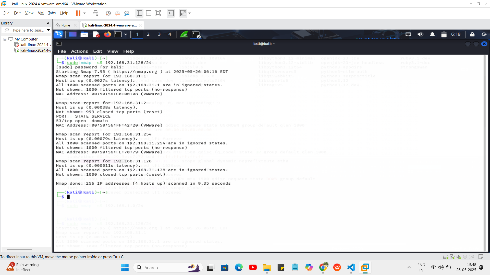
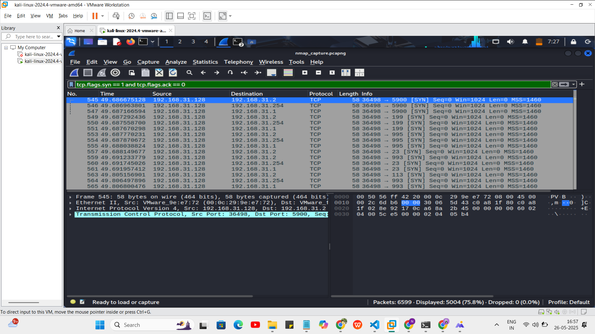

README.md

# 🔍 Task 1: Network Port Scanning and Packet Capture

This repository contains the results of Task 1 from my Cyber Security Internship. The goal of this task was to perform a basic network scan using Nmap and analyze network packets using Wireshark.

---

## 🛠 Tools Used

- **Nmap** – for scanning the local network and identifying open ports  
- **Wireshark** – for capturing and analyzing network packets during the scan  
- **Kali Linux** – the operating system used for performing all operations  

---

## 📋 What I Did

1. Found my local IP range using `ip a`
2. Scanned my network using:
   ```bash
   sudo nmap -sS 192.168.31.128/24

3. Saved the scan output to a file named scan_result.txt

4. Opened Wireshark and selected the eth0 interface to start capturing packets

5. Ran the Nmap scan again while capturing was active


### 🖼️ Nmap Scan Output



6. Stopped the capture after the scan and saved it as nmap_capture.pcapng

During the Nmap SYN scan, I used Wireshark to observe how packets behaved on the network.

 By applying the filter:

 ```bash
tcp.flags.syn == 1 and tcp.flags.ack == 0

### 🖼️ Wireshark Scan Screenshot

This screenshot shows captured TCP SYN packets during the Nmap scan:



I was able to isolate TCP SYN packets — these are the initial packets Nmap sends to check if a port is open. If a port is open, the target replies with a SYN-ACK. If it is closed, the target usually sends a RST packet back.

Each packet shows:

Source IP: my Kali Linux machine

Destination IP: other devices on the network

Destination Port: common ports like 22 (SSH), 80 (HTTP), 443 (HTTPS)

This helped me understand how port scanning works at the packet level and how attackers or admins can detect open ports by analyzing SYN responses.

## Files Included

- scan_result.txt → Nmap scan result
- nmap_capture.pcapng → Wireshark packet capture file
- README.md → Project documentation (this file)

## 🧠 What I Learned

- How to scan a local network to find live hosts and open ports
- The meaning of SYN, ACK, and RST in TCP communications
- How to observe port scanning behavior in packet captures
- How attackers or administrators might detect services using Nmap

---

## ✅ Outcome

I completed Task 1 successfully and understood the basics of port scanning and packet analysis.  
This task helped me gain hands-on experience in network forensics and reconnaissance.
